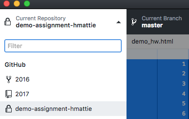
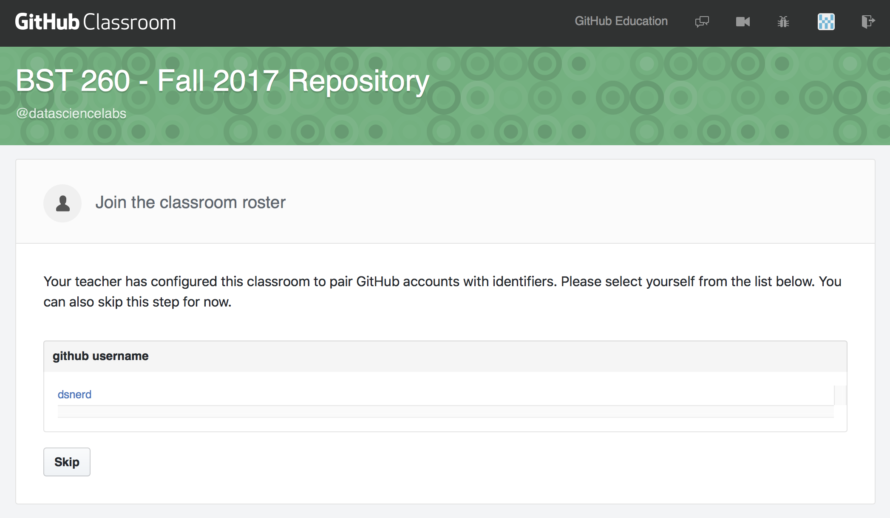
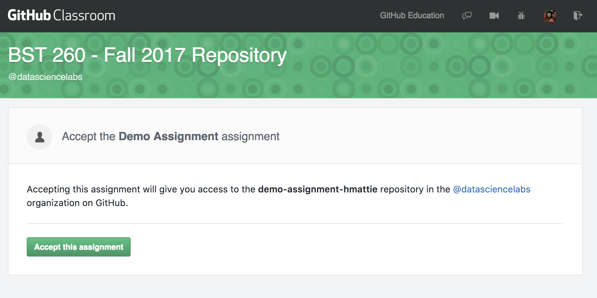
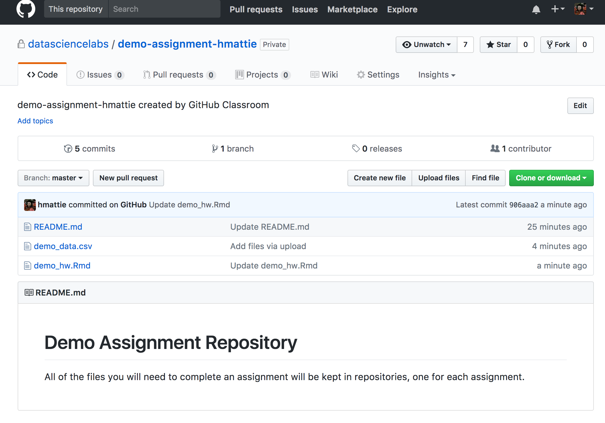
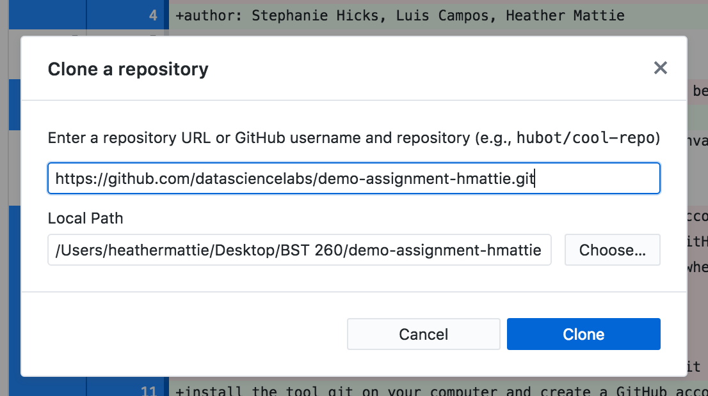

Starting with homework 1, we will be using 
git and GitHub to get your homework assignment, work on your homework, 
and submit your homework solutions. This tutorial will walk you through 
that process using git and GitHub. 

## Downloading GitHub desktop
First, download GitHub desktop [here](https://desktop.github.com/), and install it on your computer.

During installation, you will have to choose a repository. Your available repositories should be shown on the left side of the screen when you open GitHub desktop.

## Getting and Working on Homework

The link for each homework assignment will be available on the Lectures tab of the course website. For this demo, click this [link](https://classroom.github.com/a/l72K0d-w). After clicking on the link, something like this should pop up: 

1. Click 'Authorize github'. Next, you should see this:

2. Click on your username. This will create your own individual, private repository to submit your homework. Only the instructors, TAs and you will be able to see your work. You should then see this:

3. Click 'Accept this assignment'. You should then see this:

After clicking the link, the assignment repository should show up with the instructions and all necessary files. An example of what this will look like is here:

### Cloning your Homework repository

1. Click the green 'Clone or download' button, and choose 'Open in desktop'.

This will open GitHub desktop and you should see this window pop up:

2. Choose local path, i.e., where you would like to store a folder containing the files in the repository. You now have a local copy of the files contained in the respoitory where you specified them to be. For this example, I chose to create a folder called BST 260, and sent the folder there. The name of the folder will be the name of the repository. For this example, it's 'demo-assignment-hmattie'. 

### Working on your homework

Once you have a local copy of your repository, it's time to get to work! 

After writing some of your homework in an `Rmd` file, `knit`ing it, 
making pretty plots, and finding out some cool stuff about the dataset, it's 
time to `commit/push`.

1. Save your file(s) and open GitHub desktop. The files you worked on should be listed. Make sure you
choose the ones you worked on, and then click 'Commit to master'. In the demo example, I added some code to the 'demo_hw.Rmd' file,
and that is the one I have chosen to `commit`. You should also include a description of the `commit` in the summary box. It's not shown in this picture, but my description for this `commit` was 'Answered problem 1'. This description will show up later.

Cool! Now that we've saved our work on our local directory, we can now `push` 
our work to GitHub.

2. At the top of the window, click 'Push origin'. This will send your updated file(s) to your repository on GitHub. 

Note, we can (and should) do this as many times as 
we want before the homework deadline. What is great about this is that 
it will make getting help from your TA easier as well as keeping a 
copy of your work in the cloud in case your computer crashes, or you 
accidentally delete something.	

3. Check that the file(s) were successfully `pushed`. Note that the description I used, 'Answered problem 1', appears before the README.md file, and the time stamp also appears on the right side of the screen. I have successfully `pushed` my assignment.

### Summary

1. Accept the assignment and choose your username
2. Clone the assignment to your desktop
3. Work on your homework
4. Commit changes to your file(s) 
5. Push the updated file(s) to your respoitory
6. Repeat until you are satidfied with the final version and are ready for the
assignment to be graded
7. Double check your file(s) were successfully pushed 

# Late Day Policy
From the course syllabus:

> Each student is given six late days for homework at the beginning of the semester. A late day extends the individual homework deadline by 24 hours without penalty. No more than two late days may be used on any one assignment. Assignments handed in more than 48 hours after the original deadline will not be graded. We do not accept any homework under any circumstances more than 48 hours after the original deadline. Late days are intended to give you flexibility: you can use them for any reason no questions asked. You don't get any bonus points for not using your late days. Also, you can only use late days for the individual homework deadlines all other deadlines (e.g., project milestones) are hard.

We made this policy because we understand that you are all busy 
and things happen. We hope that this added flexibility makes gives you 
the freedom to enjoy the courses and engage with the material fully. 

## Some unsolicited advice

To be fair to all the students we have to enforce this late day policy, 
so we have put together a list of things to consider near the deadline.

Say the homework is due Sunday at 11:59 pm.

1. If we do not see any more `commit`s after the deadline we will take 
the last `commit` as your final submission.
2. Check that the final `commit` is showing on your Github repo page. 
"I forgot to `push`" is not an acceptable excuse for late work.
3. It may help to add a message like "This is my final version of the 
homework please grade this" but that's up to you.
4. If there are `commit`s after the deadline **we will take the last `commit`**
up to Tuesday at 11:59 pm as the final version. 
5. We will assess the number of late days you used and keep track.
6. You **do not** need to tell us that you will take extra days, we will 
be able to see the time stamp of your last `commit`.
7. When you are done with the homework, do not `commit` or `push` any more. 
If you `commit` and `push` after the deadline you will be charged a late day. 
This is strict.

# Happy `git`-ing
